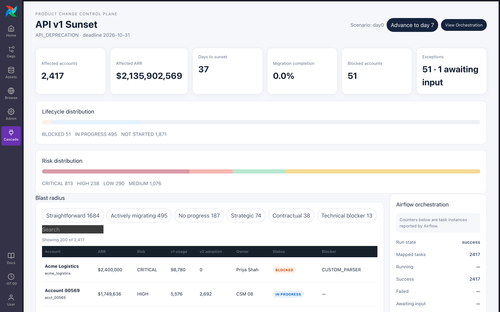

# Cascade

**API v1 shuts off on October 31. 2,417 customers, carrying $2.1B in annual
recurring revenue, are still calling it.** Cascade is an Airflow plugin that
tracks every one of them to a finished migration, and won't call an account
migrated until its telemetry agrees.

▶ [Watch the 3-minute demo](https://youtu.be/zLX3AQpTZR0)



Every number on that screen comes from a real Airflow run. Each customer is a
mapped task. A blocked $2.4M account pauses a DAG until a person decides what
to do. No account is marked migrated because someone said so; a rule over its
usage data decides.

Built for Astronomer's Beyond the DAG hackathon (2026), in the Plugin
Powerhouse category.

## Why Airflow

The hard part of shutting down an API is coordination. Thousands of accounts
move at different speeds, a few get stuck, and someone has to prove each one
finished. That means fanning out, waiting, asking a person, and checking again
later, which is what an orchestrator already does. Cascade gives the team
running the sunset a view of that program inside Airflow, instead of a
spreadsheet beside it.

## The demo

Three steps, the same ones as the video:

1. **Day 0, assess.** One DAG run finds the 2,417 accounts still calling v1
   and maps a task to each. The dashboard fills in while the run is going:
   1,871 not started, 495 in progress, 51 blocked.
2. **The exception.** Acme Logistics ($2,400,000 ARR) is blocked on a custom
   parser. Its DAG run waits on an Airflow human-in-the-loop (HITL) operator.
   You answer it from Cascade's exception queue, and the plugin sends the
   answer back to Airflow, which resumes the run.
3. **Day 7, verify.** Advance the mock world a week. A second DAG re-checks
   only the 84 accounts whose usage changed, and Acme moves to migrated
   because its v1 calls have been zero for seven days.

Along the way you can filter accounts by status, risk, and preset segments,
such as the 13 accounts blocked on a technical dependency. Every count is
computed in SQL.

## Airflow features used

| Feature | Where | What it does here |
| --- | --- | --- |
| Plugin FastAPI app (`fastapi_apps`) | `plugins/cascade/__init__.py` | Serves the Cascade API at `/cascade` from Airflow's API server |
| Plugin React app (`react_apps`) | `plugins/cascade/__init__.py`, `ui/` | Adds Cascade to Airflow's navigation at `/plugin/cascade` |
| Dynamic task mapping | `assess_account`, `verify_account` | One task instance per account: 2,417 on day 0, 84 on day 7 |
| Common AI `@task.llm` | `generate_migration_brief` | Typed `MigrationBrief` output through a Pydantic AI connection |
| `HITLOperator` | `exception_resolution.await_decision` | Defers the run until a person picks a DAG-defined option |
| `TriggerDagRunOperator` | `trigger_acme_exception` | Hands the blocked account from assessment to the exception DAG |
| `trigger_rule=ALL_DONE` | `persist_migration_brief`, `aggregate_campaign` | Keeps briefs and the rollup running when a mapped upstream task fails |
| Airflow Variable | `cascade_last_snapshot` | The telemetry watermark the verification DAG diffs against |
| Airflow REST API v2 | `include/cascade/airflow_client.py` | Reads run state, mapped task counts, and HITL forms for the UI, and submits HITL responses |

## What was hard

### Counting 2,417 mapped task states

The orchestration rail read "Airflow state unavailable" for an entire
assessment run. It tallied states by walking `listMapped`, which returns at
most 100 rows a page, so each poll cost 49 sequential Airflow calls and took
90.4 seconds during a run. Airflow reports `total_entries` for a
state-filtered query, so the client now asks for one row per state, in
parallel, for only the four states the rail shows: 0.74 seconds median against
the same run.

### Keeping the dashboard live

The dashboard polls every four seconds. The old rollup loaded every account
row to count it in Python and took 1.45 seconds, so a poll would have spent
over a third of every interval scanning, and the account list shipped 1.34 MB
per request. Both became SQL aggregates behind one shared set of segment
predicates, so a count and the rows it filters to cannot disagree: about 13 ms
warm, and a 56 KB first page of 200 rows. Ordering the distributions by value
also mattered, because the old row-scan order moved a bar segment whenever a
task rewrote a status.

### Loading React inside Airflow's React tree

The plugin first failed to mount at all. Vite 8 no longer inlines
`process.env.NODE_ENV` for library builds, so React's development check threw
`process is not defined` in the browser. Fixing that exposed the second copy of
React in the bundle: Airflow renders the plugin inside its own React tree, so
every hook resolved against a null dispatcher. Airflow publishes React,
ReactDOM, and the JSX runtime on the window, so the bundle now takes them from
there.

## Run locally

Requirements: Docker, the Astro CLI, Node.js, and pnpm.

1. Copy the environment file:

   ```bash
   cp .env.example .env
   ```

2. Pick how briefs get written. For model-written briefs, replace `REPLACE` in
   `AIRFLOW_CONN_CASCADE_LLM` with your OpenRouter key, or point the connection
   at any other pydantic-ai provider. To run without a model, delete the
   `AIRFLOW_CONN_CASCADE_LLM` line instead of leaving the placeholder. Briefs
   are then stored with `brief_source=deterministic`, and migration status is
   unaffected either way.

3. Start Airflow, build the UI bundle, and unpause the three DAGs:

   ```bash
   astro dev start
   pnpm --dir ui install
   pnpm --dir ui build
   printf 'for d in product_change_assessment exception_resolution migration_verification; do airflow dags unpause "$d"; done\n' | astro dev bash -s
   ```

   The build writes the bundle to `plugins/cascade/static/cascade.umd.cjs`.

4. If you configured a model, check it with one real call before a long run:

   ```bash
   printf 'python scripts/check_llm.py\n' | astro dev bash -s
   ```

   Airflow's own connection test resolves the model but never calls it, and a
   failed call during the run quietly falls back to a deterministic brief. The
   script calls the model through the DAG's code path and prints the
   provider's error on failure, such as an account setting the provider
   requires before it will serve the model.

5. Reset to a clean day-0 world and run the assessment:

   ```bash
   printf 'python scripts/reset_demo.py\n' | astro dev bash -s
   printf 'python scripts/prepare_hero_run.py\n' | astro dev bash -s
   ```

   `prepare_hero_run.py` waits for the assessment and asserts the day-0
   distribution. On a laptop, the assessment took 36 minutes.

6. Open Cascade from Airflow's navigation at
   `http://localhost:8080/plugin/cascade`. From the scenario controls you can
   advance the mock world to day 7 and run verification, which maps only the
   changed accounts and finishes in under a minute.

The Airflow UI is at `http://localhost:8080/`, the Cascade API at `/cascade`,
and the mock vendor systems at `http://localhost:8001/`.

### If the mock systems do not answer

If `http://localhost:8001/health` does not answer, the `mock-services`
container from `docker-compose.override.yml` came up attached to no network.
Airflow then cannot resolve `mock-services`, so the scenario controls and
telemetry break without an obvious error. Compose reuses the container, so
`astro dev restart` does not repair it. Recreate it:

```bash
astro dev kill && astro dev start
```

### Regenerating fixtures

Fixture generation is seeded and checks its own output:

```bash
python scripts/generate_fixtures.py
```

## How it works in detail

One rule holds everywhere: migration status comes only from deterministic
rules over telemetry, in `include/cascade/rules.py`. A model writes
explanations and never writes status, so a model outage cannot move a number.

Cascade has four parts:

- Three DAGs: `product_change_assessment` classifies every affected account,
  `exception_resolution` pauses for a human decision, and
  `migration_verification` re-checks the accounts whose usage changed.
- An Airflow 3 plugin: a FastAPI app serves the Cascade API at `/cascade` from
  Airflow's API server, and a React app adds Cascade to Airflow's navigation at
  `/plugin/cascade`.
- The Cascade store: a `cascade` Postgres database on the Airflow Postgres
  server holds accounts, exceptions, and the timeline. Airflow tasks write every
  account row. The plugin writes only campaign bookkeeping, such as which
  verification run to follow, and the resolved state of an exception whose
  decision it relayed to Airflow.
- Mock vendor systems: `mock_services/` serves usage telemetry, CRM and contract
  records, the change definition, and a scenario clock with day-0 and day-7
  snapshots, all from deterministic fixtures.

The design keeps one boundary: fake the world, never fake the orchestration.
The vendor systems are mocks. The scheduler, the DAG runs, the 2,417 mapped
task instances, the HITL pause, the plugin, and, when a model connection is
configured, the model call are real.

### Assessment: day 0

1. `load_change` reads the change from the mock systems and records the
   campaign with this run's id.
2. `discover_affected_accounts` asks the usage system which accounts called v1
   or v2. The mapped count comes from that response, not from configuration:
   2,417 on day 0.
3. `assess_account` runs once per account, at most 16 at a time. Each instance
   reads usage, CRM, and contract data, applies a first-match-wins status table
   (migrated, ready to verify, blocked, in progress, not started), derives risk
   from ARR and status, and writes the account row and a timeline event. A
   blocked account also gets a pending exception.
4. `select_high_risk` takes the eight highest-ARR accounts outside the standard
   segment, and `generate_migration_brief`, a `@task.llm` task, asks the model
   for a typed `MigrationBrief` under the system prompt "You explain migration
   evidence. You never decide migration status."
5. If a model call fails, from a missing connection, a provider error, or
   output that does not validate, `persist_migration_brief` still runs
   (`trigger_rule=ALL_DONE`) and stores a deterministic brief with
   `brief_source=deterministic`. Status and the rollup never read the brief,
   so nothing else changes.
6. `aggregate_campaign` rolls the campaign up, and a `TriggerDagRunOperator`
   starts `exception_resolution` for Acme Logistics.

### Exception: the human decision

1. `exception_resolution` loads Acme's account and builds a review packet with
   its ARR, v1 and v2 call counts, and blocker.
2. `HITLOperator` defers the run on `await_decision`, with three options
   defined in the DAG and a required reason. Cascade's exception queue shows
   the row as awaiting input and renders the options it reads from Airflow,
   rather than defining its own.
3. The operator's answer goes back to Airflow through the plugin.
   `apply_decision` records it with an `EXTENSION_GRANTED` event, and
   `write_timeline_event` closes the exception with `EXCEPTION_RESOLVED`.
4. If the HITL task completes without a chosen option, `apply_decision` raises
   instead of recording a decision nobody made.

### Verification: day 7

1. The scenario controls advance the mock world to day 7 and trigger
   `migration_verification`. The plugin records the run id, so the UI's
   orchestration rail follows the new run.
2. `find_accounts_with_changed_usage` compares each account's daily v1 and v2
   calls against the snapshot named in the `cascade_last_snapshot` Airflow
   Variable. On day 7, 84 accounts changed.
3. `verify_account` runs once per changed account and re-applies the same
   status rules. Acme moves to migrated because its v1 calls have been zero
   for seven days while its v2 calls continue.
4. If a changed account has no assessed row, `verify_account` fails that
   instance rather than inventing one.

## Project layout

- `dags/`: assessment, exception-resolution, and migration-verification DAGs
- `include/cascade/`: rules, fixtures, models, store, API clients, and links
- `mock_services/`: deterministic vendor-system FastAPI service
- `plugins/cascade/`: Airflow FastAPI and React plugin entrypoints
- `scripts/`: schema setup, demo reset, hero-run preparation, fixture
  generation, and the model connection check
- `ui/`: the React frontend, with every style scoped under `#cascade-root` so
  it cannot restyle Airflow's own UI
- `tests/`: rules, aggregate, store, and DAG integrity tests

## License

Apache License 2.0; see [`LICENSE`](LICENSE).
